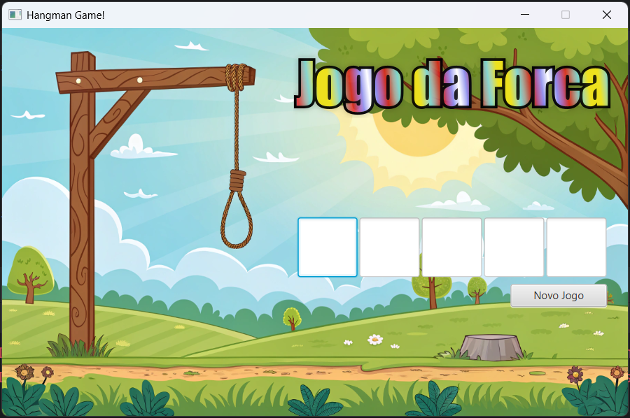
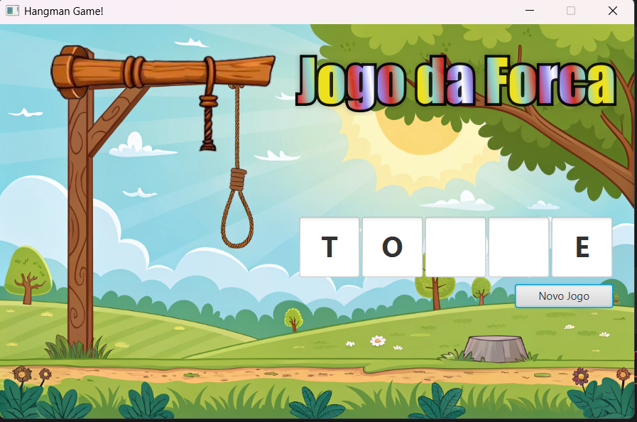
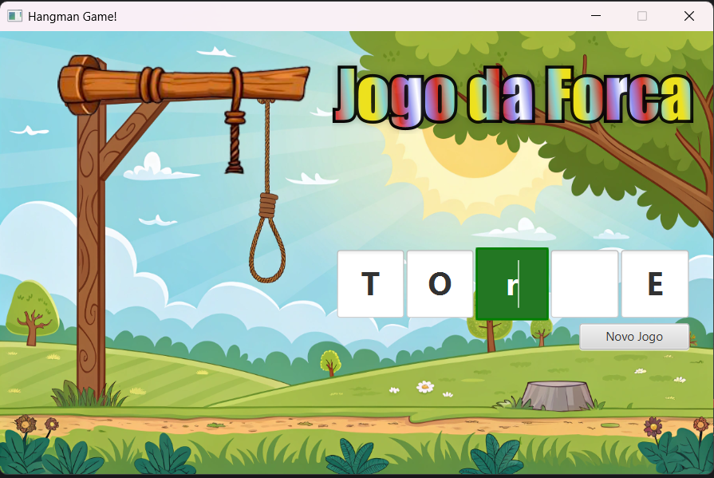
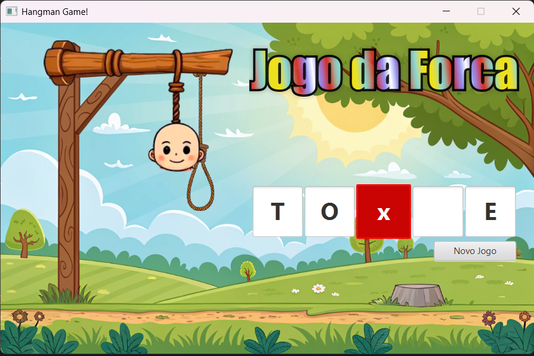
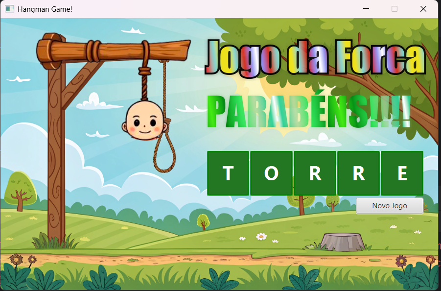
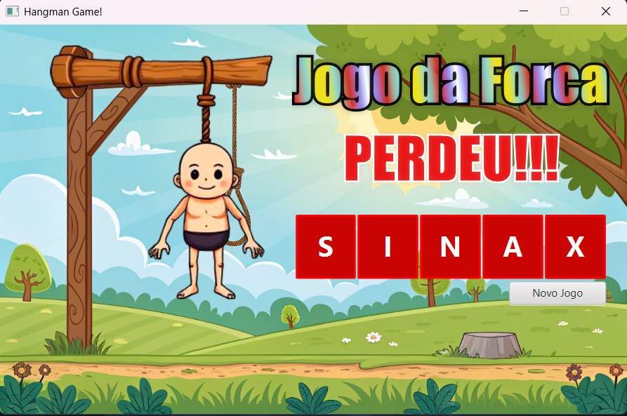

# 🎮 Jogo da Forca

## 🧠 O que é o Jogo da Forca?

O **Jogo da Forca** é um passatempo clássico de adivinhação de palavras. Nele, o jogador deve descobrir uma palavra oculta, sugerindo letras uma a uma. A cada erro, uma parte do boneco da forca é desenhada, simbolizando o limite de tentativas. O jogo é vencido se a palavra for descoberta antes do boneco ser completado — caso contrário, o jogador perde.

### 📜 Breve História

O jogo da forca tem origens incertas, mas registros apontam para sua popularidade no século XIX, especialmente entre crianças, como uma forma de aprendizado lúdico de vocabulário. Ele apareceu em publicações e escolas e, com a popularização da informática, migrou naturalmente para o ambiente digital, mantendo sua simplicidade e caráter educativo.

---

## 🛠️ Tecnologias Utilizadas

Este projeto foi desenvolvido utilizando:

- **Java 24** – Linguagem principal
- **JavaFX** – Biblioteca gráfica para interface do usuário
- **FXML** – Para estruturação declarativa da interface
- **Bindings e Properties** – Para controle reativo dos componentes
- **CSS (JavaFX)** – Para estilização visual da aplicação

---

## 📁 Recursos Visuais

A seguir, algumas imagens e um vídeo demonstrativo do jogo:

### 📷 Imagens

| Tela                          | Descrição                        |
|------------------------------|----------------------------------|
|         | Tela inicial do jogo             |
|       | Novo jogo iniciado               |
|   | Letra correta revelada           |
|    | Letra incorreta e erro adicionado|
|        | Tela de vitória                  |
|        | Tela de derrota                  |

### 🎥 Vídeo

https://github.com/user-attachments/assets/afc6d72c-bf16-4ecb-aae1-8b7e933c5cf7

---

## 🚀 Como Executar o Projeto

> ⚠️ Certifique-se de estar utilizando o **Java 24** e que o **JavaFX** esteja corretamente configurado na sua IDE ou ferramenta de build.

### Via IDE (IntelliJ, Eclipse)

1. Clone o repositório
2. Importe como projeto Java
3. Configure o JavaFX se necessário
4. Execute a classe principal (`HelloApplication`, `Main`, etc.)

### Via terminal (Gradle)

```bash
./gradlew run
```

> No Windows: `gradlew.bat run`

---

## 👤 Autor

Desenvolvido por **Swellington Soares**

---

## 📝 Licença

Este projeto está licenciado sob a [Licença MIT](LICENSE).
